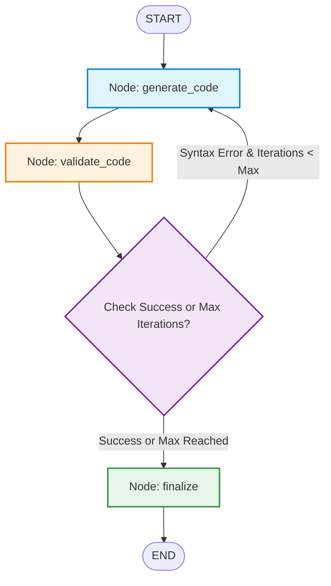
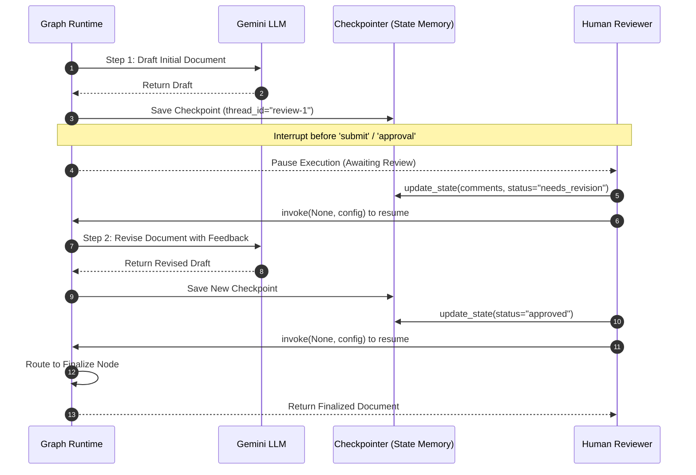
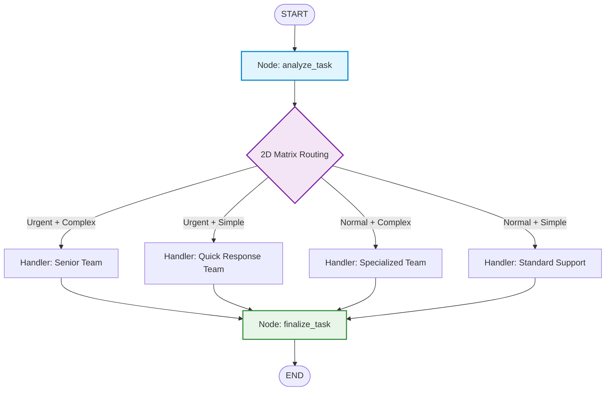
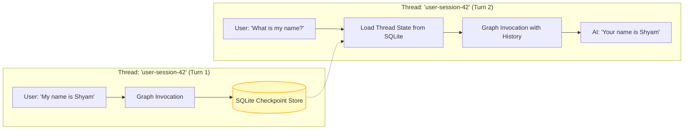

# 🚀 Production-Ready LangChain & LangGraph Reference Architecture

[](https://www.python.org/)
[](https://github.com/langchain-ai/langchain)
[](https://github.com/langchain-ai/langgraph)
[](https://www.trychroma.com/)
[](https://ai.google.dev/)
[](https://smith.langchain.com/)

An enterprise-grade, comprehensive repository demonstrating practical patterns for building scalable, stateful, and observable generative AI systems. This codebase bridges the gap between basic tutorials and production-ready applications, covering foundational **LangChain Expression Language (LCEL)**, document ETL & vector indexing, advanced RAG architectures, and complex **LangGraph** workflows featuring cyclic loops, state persistence, multi-variable routing, human-in-the-loop governance, and self-correcting agents.

---

## 📑 Table of Contents

- [Architectural Overview](#-architectural-overview)
- [Repository Structure](#-repository-structure)
- [Core Modules & Capabilities](#-core-modules--capabilities)
  - [1. LangChain Fundamentals (`langchain_fundamentals/`)](#1-langchain-fundamentals-langchain_fundamentals)
  - [2. Advanced LCEL Chains & Debugging (`chains/`)](#2-advanced-lcel-chains--debugging-chains)
  - [3. Document Ingestion ETL (`document_loaders/`)](#3-document-ingestion-etl-document_loaders)
  - [4. Semantic & Structural Text Splitting (`text_splitters/`)](#4-semantic--structural-text-splitting-text_splitters)
  - [5. Dense Embeddings & Vector Math (`Embeddings/`)](#5-dense-embeddings--vector-math-embeddings)
  - [6. Vector Storage, Filtering & RAG (`vectors/`)](#6-vector-storage-filtering--rag-vectors)
  - [7. Production Observability & Smart Q&A Bot (`smart_QA_bot/`)](#7-production-observability--smart-qa-bot-smart_qa_bot)
  - [8. LangGraph State Machine Architectures (`langgraph/`)](#8-langgraph-state-machine-architectures-langgraph)
- [Key Workflow Diagrams](#-key-workflow-diagrams)
  - [Cyclic Self-Correcting Code Generation](#a-cyclic-self-correcting-code-generation)
  - [Human-in-the-Loop (HITL) Iterative Review](#b-human-in-the-loop-hitl-iterative-review)
  - [Multi-Variable Decision Matrix Routing](#c-multi-variable-decision-matrix-routing)
  - [Persistent Checkpointed Multi-Turn State](#d-persistent-checkpointed-multi-turn-state)
- [Environment Setup & Installation](#-environment-setup--installation)
- [Execution & Quickstart Guide](#-execution--quickstart-guide)
- [Production Engineering Patterns](#-production-engineering-patterns)
- [License & Authors](#-license--authors)

---

## 🏛 Architectural Overview

The repository is divided into progressive tiers of complexity:

```
┌─────────────────────────────────────────────────────────────────────────────┐
│                           APPLICATION / AGENT TIER                          │
│  • Smart Q&A Bot (Pydantic Output, Fallback & Tracing)                      │
│  • Autonomous Research Agent (Depth Loops & Synthesis)                      │
│  • Self-Correcting Code Writer (Syntax Verification & Iteration)             │
│  • Human-in-the-Loop Governance (Interrupts & Multi-Round Review)           │
├─────────────────────────────────────────────────────────────────────────────┤
│                          ORCHESTRATION & STATE TIER                         │
│  • LangGraph StateGraphs (TypedDict State, Reducers, Conditional Edges)     │
│  • Persistence Engines (MemorySaver, SqliteSaver, Thread IDs)               │
│  • Multi-Path Routing (Dynamic Decision Matrices)                           │
├─────────────────────────────────────────────────────────────────────────────┤
│                           RETRIEVAL & STORAGE TIER                          │
│  • ChromaDB Vector Store (Cosine Distance, Metadata Filters)                │
│  • Advanced Retrievers (MMR Diversity, Top-K Similarity)                    │
│  • Google GenAI Embeddings (`gemini-embedding-001`)                         │
├─────────────────────────────────────────────────────────────────────────────┤
│                             DATA INGESTION TIER                             │
│  • Loaders: PyPDFLoader, WebBaseLoader (bs4), DirectoryLoader (Lazy)        │
│  • Splitters: RecursiveCharacter, MarkdownHeader, Language (Python)         │
├─────────────────────────────────────────────────────────────────────────────┤
│                         FOUNDATIONAL RUNTIME & LCEL                         │
│  • LCEL Runnables: RunnableParallel, RunnablePassthrough, RunnableLambda   │
│  • Universal Chat Models (`init_chat_model` with Google GenAI)              │
│  • Structured Outputs & Custom Parsers (Pydantic, JSON, StrOutputParser)    │
│  • Observability & Distributed Tracing (LangSmith)                          │
└─────────────────────────────────────────────────────────────────────────────┘
```

---

## 📂 Repository Structure

```tree
.
├── .env                                # Environment secrets (API Keys, Tracing flags)
├── .gitignore                          # VCS ignore patterns
├── pyproject.toml                      # Project configuration and dependency specifications
├── requirements.txt                    # Pinned package requirements
├── uv.lock                             # Fast package resolver lockfile
├── main.py                             # Project entrypoint
│
├── langchain_fundamentals/             # Foundational LCEL, LLM init, and parsing
│   ├── core_concepts.py                # LCEL chaining, batching, and token streaming
│   ├── invoke_llm.py                   # Minimal LLM invocation template
│   ├── main.py                         # Environment validation and version inspection
│   ├── output_parsers_demo.py          # Str, JSON, Pydantic parsers & with_structured_output
│   ├── prompt_messages.py              # ChatPromptTemplates, FewShot prompts, and messages
│   └── working_with_llms.py            # Chat initialization and role-based messaging
│
├── chains/                             # Advanced LCEL execution topologies
│   └── basic_and_parallel_chains.py    # RunnableParallel, Passthrough, Branch, and debugging
│
├── document_loaders/                   # Document ETL & data ingestion pipelines
│   ├── lazy_loader.py                  # DirectoryLoader with memory-efficient generator loading
│   ├── pdf_loaders.py                  # PDF ingestion via PyPDFLoader
│   ├── text_loaders.py                 # Plain text file loading and metadata handling
│   └── web_loaders.py                  # HTML/Web extraction with BeautifulSoup parsing
│
├── text_splitters/                     # Text chunking strategies
│   └── text_splitters.py               # Recursive, Markdown Header, and AST-aware Code splitters
│
├── Embeddings/                         # Vector embedding generation & math
│   └── embeddings_deep.py              # Query vs Document vectors and cosine similarity calculations
│
├── vectors/                            # Vector databases & RAG implementations
│   └── vector_stores_chroma.py         # Chroma CRUD, disk persistence, MMR, and LCEL RAG chains
│
├── smart_QA_bot/                       # Enterprise Q&A microservice
│   └── smart_bot_section1.py           # Structured output, error recovery & LangSmith tracing
│
└── langgraph/                          # Stateful cyclic graphs & multi-agent systems
    ├── langgraph_core.py               # StateGraph fundamentals, compilation, and Mermaid output
    ├── accumulating_state_graph.py     # State reducers (`operator.add`) & value streaming
    ├── multinode_state_graph.py        # Multi-node sequential pipeline (Analyze -> Enhance -> Finalize)
    ├── conditional_edges.py            # Intent-based query classification & branch dispatch
    ├── conditional_looping_graph.py    # Score-driven quality review loops
    ├── first_full_in_depth_graph.py    # Sentiment-adaptive conversational agent
    ├── checkpointing.py                # In-memory and SQLite multi-turn conversation persistence
    ├── human_in_loop.py                # Graph interruptions (`interrupt_before`), inspect & mutate
    ├── human_in_loop_with_iterative_cycle.py # Multi-round human document review workflows
    ├── iterative_research_agent_with_loops.py # Depth-first research agent with inquiry loops
    ├── message_state_chat_pattern.py   # Canonical chat pattern over message states
    ├── multi_path_routing.py           # 2D decision matrix (Urgency x Complexity) task router
    └── self_correcting_code_writer.py  # Code generation -> Python AST compile -> auto-repair loop
```

---

## 🧩 Core Modules & Capabilities

### 1. LangChain Fundamentals (`langchain_fundamentals/`)

Demonstrates modern LangChain (v1.3+) patterns using the universal `init_chat_model` abstraction, avoiding deprecated provider-specific entrypoints.

- **Universal Model Initialization**: Dynamically binds providers (e.g. `google_genai`) and model variants (e.g. `gemini-3.5-flash-lite`) with standardized interfaces.
- **Core LCEL Execution Modes**: Single invocation (`invoke`), concurrent multi-request processing (`batch`), and real-time response rendering (`stream`).
- **Prompt Engineering & Few-Shot Learning**: `FewShotChatMessagePromptTemplate` used with strict message schemas (`SystemMessage`, `HumanMessage`, `AIMessage`).
- **Structured Outputs**:
  - `StrOutputParser`: Raw text stream extraction.
  - `JsonOutputParser`: Dynamic JSON schema enforcement.
  - `PydanticOutputParser`: Formal schema validation with injected format instructions.
  - `.with_structured_output(BaseModel)`: Native tool-calling/schema enforcement returning strongly-typed Pydantic instances.

---

### 2. Advanced LCEL Chains & Debugging (`chains/`)

Implements advanced Runnable compositions:

- **`RunnableParallel`**: Executes non-dependent tasks concurrently (e.g., generating text summaries and keyword tags in a single pass).
- **`RunnablePassthrough` & `RunnableLambda`**: Pipes unmodified user queries alongside dynamic context lookups into downstream prompts.
- **`RunnableBranch`**: Performs routing by evaluating conditional predicate functions against input payloads.
- **Deep Inspection & Observability**:
  - Inspecting runtime input/output schemas via `.input_schema.model_json_schema()`.
  - Attaching runtime telemetry metadata using `.with_config(run_name=...)`.
  - Inserting intermediate logger steps via `RunnableLambda(log_step)`.

---

### 3. Document Ingestion ETL (`document_loaders/`)

Robust document ingestors handling various source modalities:

- **`PyPDFLoader`**: Extracts text from PDF streams with metadata mapping.
- **`WebBaseLoader`**: Fetches and cleans web pages using `BeautifulSoup4` with configurable parser selectors.
- **`TextLoader`**: Standard text document ingestion.
- **`DirectoryLoader` with `lazy_load()`**: Generator-based streaming ingestion to process large datasets without exhausting memory.

---

### 4. Semantic & Structural Text Splitting (`text_splitters/`)

Context-aware chunking strategies to optimize embedding retrieval:

- **`RecursiveCharacterTextSplitter`**: Multi-tiered boundary splitting (`["\n\n", "\n", " ", ""]`) preserving semantic paragraph and sentence cohesion.
- **`MarkdownHeaderTextSplitter`**: Parses Markdown hierarchies (`#`, `##`, `###`), attaching heading lineage directly into chunk metadata for downstream filtering.
- **`Language`-Aware Splitter**: Code-syntax-aware splitting for Python (`Language.PYTHON`), keeping functions, docstrings, and classes intact.

---

### 5. Dense Embeddings & Vector Math (`Embeddings/`)

Vector space transformations using Google GenAI (`gemini-embedding-001`):

- **Query vs Document Embeddings**: Differentiating `embed_query` (search vector) from `embed_documents` (corpus indexing).
- **Vector Math**: Direct implementation of vector Euclidean norm ($||\mathbf{u}||$) and Cosine Similarity metric:
  $$\text{Similarity}(\mathbf{u}, \mathbf{v}) = \frac{\mathbf{u} \cdot \mathbf{v}}{\|\mathbf{u}\|_2 \|\mathbf{v}\|_2}$$

---

### 6. Vector Storage, Filtering & RAG (`vectors/`)

Production ChromaDB patterns for vector search and RAG:

- **Vector Store Operations**: Collection creation, batch ingestion, and persistent storage on disk (`persist_directory="./chroma_db/"`).
- **Scored Search & Metadata Filtering**: Similarity search returning similarity scores and applying structured metadata filters (e.g., `filter={"topic": "..."}`).
- **Retrieval Strategies**:
  - **Standard Similarity**: Top-$K$ nearest neighbors.
  - **Maximal Marginal Relevance (MMR)**: Balancing relevance with diversity (`fetch_k=5`, `k=2`) to eliminate redundant context chunks.
- **End-to-End RAG Chain**: Composing vector store retrievers with LCEL chains for grounded question answering.

---

### 7. Production Observability & Smart Q&A Bot (`smart_QA_bot/`)

An enterprise-ready microservice implementation featuring:

- **Pydantic Schema Contract (`QAResponse`)**:
  ```python
  class QAResponse(BaseModel):
      answer: str
      confidence: str  # "high" | "medium" | "low"
      reasoning: str
      follow_up_questions: List[str]
      sources_needed: bool
  ```
- **Distributed Tracing**: Decorated with `@traceable` for full observability in **LangSmith** dashboards.
- **Resilient Fallback Handling**: `try/except` safeguards returning structured fallback responses without throwing unhandled runtime exceptions.
- **Batch Processing**: Parallel inference with `.batch()`.
- **Trace Flushing**: Guaranteed delivery of background telemetry events in ephemeral environments via `Client().flush()`.

---

### 8. LangGraph State Machine Architectures (`langgraph/`)

Thirteen distinct graph implementations covering all essential LangGraph design patterns:

| File | Pattern | Core Mechanism |
| :--- | :--- | :--- |
| `langgraph_core.py` | Basic StateGraph | `TypedDict` state, explicit edges (`START` $\to$ Node $\to$ `END`), Mermaid export |
| `accumulating_state_graph.py` | State Reducers | `Annotated[list, operator.add]`, `stream_mode="values"` |
| `multinode_state_graph.py` | Sequential Pipelines | Multi-node transformation chain (Analyze $\to$ Enhance $\to$ Finalize) |
| `message_state_chat_pattern.py` | Conversational State | Chat loop over standard message collections |
| `conditional_edges.py` | Query Classifier | Semantic router dispatching between Question, Command, and Statement handlers |
| `conditional_looping_graph.py` | Quality Evaluation Loop | Iterative self-refinement until quality threshold ($\ge 7$) or max iterations reached |
| `first_full_in_depth_graph.py` | Sentiment Adaptive Agent | Dynamic system prompt adjustment based on extracted emotional polarity |
| `multi_path_routing.py` | 2D Decision Routing | 2x2 Matrix classification (Urgency $\times$ Complexity) dispatching to specialized tiers |
| `self_correcting_code_writer.py` | Self-Correcting Loop | Code generation $\to$ Python compilation check $\to$ Error diagnosis $\to$ Self-repair loop |
| `iterative_research_agent_with_loops.py` | Deep Research Agent | Autonomous exploration: Fact generation $\to$ Follow-up inquiry $\to$ Depth loop $\to$ Synthesis |
| `checkpointing.py` | State Persistence | `MemorySaver` & durable `SqliteSaver` across independent thread sessions (`thread_id`) |
| `human_in_loop.py` | HITL Interruption | `interrupt_before=["node"]`, inspecting via `get_state()`, updating via `update_state()` |
| `human_in_loop_with_iterative_cycle.py` | Multi-Round Human Review | Cyclic human feedback loops with state transitions (`needs_revision` $\to$ `approved`) |

---

## 📊 Key Workflow Diagrams

### A. Cyclic Self-Correcting Code Generation


---

### B. Human-in-the-Loop (HITL) Iterative Review


---

### C. Multi-Variable Decision Matrix Routing


---

### D. Persistent Checkpointed Multi-Turn State


---

## 🛠 Environment Setup & Installation

### Prerequisites
- **Python**: Version `3.11` or higher
- **Google AI Studio API Key**: Required for Gemini LLM and Embeddings
- **LangSmith API Key** *(Optional, recommended)*: For distributed tracing and monitoring

### 1. Clone & Navigate
```bash
git clone <repository_url>
cd prd-ready-langc-lang-project
```

### 2. Environment Configuration
Create a `.env` file in the root directory:
```bash
# Google Gemini API Key
GEMINI_API_KEY=your_gemini_api_key_here

# LangSmith Observability (Optional)
LANGSMITH_API_KEY=your_langsmith_api_key_here
LANGSMITH_TRACING=true
LANGCHAIN_TRACING_V2=true
LANGSMITH_PROJECT=Smart Q&A Bot Project
```

### 3. Dependency Installation

#### Using `uv` (Fastest)
```bash
# Create virtual environment and install dependencies
uv sync
```

#### Using standard `pip` / `venv`
```bash
python3 -m venv .venv
source .venv/bin/activate
pip install -r requirements.txt
```

---

## 🚀 Execution & Quickstart Guide

All modules are designed as self-contained executable scripts with built-in demonstrations.

### Run LangChain Fundamentals
```bash
# Basic LCEL, streaming, and batching
python langchain_fundamentals/core_concepts.py

# Output parsers (Str, JSON, Pydantic, Structured Output)
python langchain_fundamentals/output_parsers_demo.py

# Few-shot prompts & message templates
python langchain_fundamentals/prompt_messages.py
```

### Run Advanced Chains & Parallel Processing
```bash
python chains/basic_and_parallel_chains.py
```

### Run Document Loaders & Splitters
```bash
# Ingest PDF, text, and web pages
python document_loaders/pdf_loaders.py
python document_loaders/web_loaders.py
python document_loaders/lazy_loader.py

# Semantic text chunking
python text_splitters/text_splitters.py
```

### Run Embeddings, ChromaDB & RAG
```bash
# Embedding cosine similarity calculation
python Embeddings/embeddings_deep.py

# ChromaDB vector store, MMR retrieval & LCEL RAG chain
python vectors/vector_stores_chroma.py
```

### Run the Production Q&A Bot
```bash
python smart_QA_bot/smart_bot_section1.py
```

### Run LangGraph Multi-Agent Systems
```bash
# Core state graph & mermaid visualization
python langgraph/langgraph_core.py

# Multi-path matrix router
python langgraph/multi_path_routing.py

# Cyclic self-correcting Python code writer
python langgraph/self_correcting_code_writer.py

# Autonomous depth-first research agent
python langgraph/iterative_research_agent_with_loops.py

# Multi-turn memory & SQLite checkpointing
python langgraph/checkpointing.py

# Human-in-the-loop pause, review & resume
python langgraph/human_in_loop.py
python langgraph/human_in_loop_with_iterative_cycle.py
```

---

## 🛡 Production Engineering Patterns

| Pattern | Problem Addressed | Codebase Implementation |
| :--- | :--- | :--- |
| **Universal Model Factory** | Vendor lock-in & fragmented APIs | Using `init_chat_model` with `model_provider="google_genai"` across all modules. |
| **Strict Schema Enforcement** | Hallucinations & unpredictable string responses | Enforcing Pydantic models via `.with_structured_output(Schema)` in `smart_bot_section1.py` and `output_parsers_demo.py`. |
| **Deterministic Looping Limits** | Runaway execution & token exhaustion | Implementing guardrails (`max_iterations`, `max_depth`) in all cyclic LangGraph state machines. |
| **State Reducers** | Accidental overwriting of message histories | Using `Annotated[list, operator.add]` to append messages and state logs incrementally. |
| **Durable Thread Checkpointing** | Stateless HTTP session loss | Leveraging `SqliteSaver` with distinct `thread_id` keys to isolate multi-tenant conversation histories. |
| **Safe Telemetry Flushing** | Dropped traces in CLI/ephemeral batch processes | Explicitly invoking `Client().flush()` in process termination handlers. |
| **Memory-Safe ETL** | Out-of-memory errors on large document ingestions | Implementing generator-based `DirectoryLoader.lazy_load()`. |

---

## 📄 License & Authors

- **Author**: Shyam
- **License**: MIT
- **Dependencies**: Built on [LangChain](https://github.com/langchain-ai/langchain), [LangGraph](https://github.com/langchain-ai/langgraph), [Chroma](https://www.trychroma.com/), and [Google GenAI](https://ai.google.dev/).